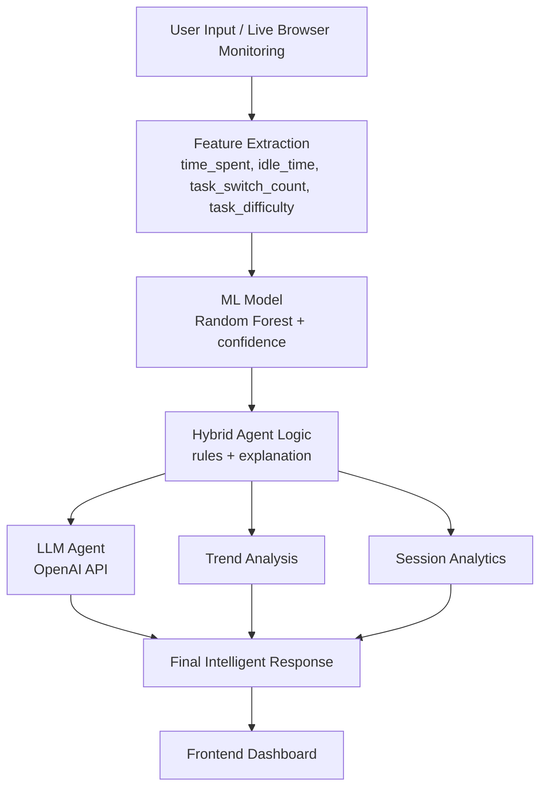

# Context-Aware Task Switching Agent

## 1. Business Problem
Knowledge workers and students often lose productivity because they switch tasks too frequently, stay idle for long periods, or continue working even when mental fatigue is increasing. Most task tools only track lists and deadlines, but they do not understand behavioral signals in real time. This project addresses that gap by monitoring simple activity patterns and generating context-aware focus recommendations.

## 2. Possible Solution
A practical solution is to build an intelligent assistant that observes lightweight behavioral signals, predicts the user's focus state, applies decision rules, and returns actionable guidance. Instead of relying only on manual self-reporting, the system can combine:

- behavior tracking
- machine learning prediction
- explainable rules
- LLM-based coaching

## 3. Implemented Solution
This project implements a hybrid agentic AI workflow:

1. The frontend tracks activity signals such as `time_spent`, `idle_time`, and `task_switch_count`.
2. The backend sends these features to a Random Forest model to predict `High`, `Medium`, or `Low` focus.
3. Rule-based agent logic adjusts the prediction when behavioral context suggests a safer interpretation.
4. The backend generates explanations, confidence, trend analysis, and session analytics.
5. An OpenAI-powered LLM converts the structured output into a short human-friendly suggestion.

The application supports:

- manual mode for testing
- semi-automated live monitoring
- focus prediction with confidence
- explainable reasoning
- trend analysis across recent predictions
- session summary analytics
- optional memory and personalization hooks

## 4. Tech Stack Used

### Frontend
- HTML
- CSS
- JavaScript

### Backend
- Python
- Flask
- Flask-CORS

### Machine Learning
- scikit-learn
- RandomForestClassifier

### LLM Layer
- OpenAI Python SDK

### Supporting Tools
- python-dotenv
- Pickle (`model.pkl`)

## Project Structure

```text
project/
├── app.py
├── .env.example
├── README.md
├── backend/
│   ├── __init__.py
│   ├── agent.py
│   ├── analytics.py
│   ├── llm_agent.py
│   ├── memory.py
│   ├── ml_model.py
│   ├── model.pkl
│   ├── routes.py
│   ├── tools.py
│   └── utils.py
├── frontend/
│   └── index.html
└── docs/
    └── ARCHITECTURE.md
```

## 5. Architecture Diagram



### Request Flow

```text
Auto Monitoring / Manual Input
        ->
Feature Extraction
        ->
ML Focus Prediction
        ->
Rule-Based Agent Reasoning
        ->
LLM Suggestion Generation
        ->
Trend + Session Analytics
        ->
Frontend Dashboard Response
```

## 6. How To Run In Local

### Prerequisites
- Python 3.10+
- OpenAI API key

### Install dependencies
```bash
pip install flask flask-cors scikit-learn openai python-dotenv
```

### Configure environment
Create a local `.env` file in the project folder using `.env.example`:

```env
OPENAI_API_KEY=your_openai_api_key_here
OPENAI_MODEL=gpt-4o-mini
```

### Run the backend
From the project folder:

```bash
python app.py
```

If you want to run it on port `5001`:

```bash
python -c "from app import app; app.run(debug=False, port=5001)"
```

### Open the frontend
Open `frontend/index.html` in the browser.

### Use the application
- Click `Start Monitoring`
- Choose task difficulty
- Let the app track activity or use manual input
- Click `Analyze Focus` or wait for auto-analysis
- View focus level, recommendation, reason, trend, confidence, and session insight

## Demo Guide: Testing Focus Levels

For a quick demo, use manual mode so the output is easy to control and explain.

### Step 1: Start the project
Run the backend:

```bash
python -c "from app import app; app.run(debug=False, port=5001)"
```

Then open:

```text
frontend/index.html
```

### Step 2: Use manual input
Uncheck:

```text
Use live monitoring data for automatic and manual analysis
```

This allows you to enter fixed values for demo scenarios.

### Step 3: Low focus scenario
Use these values:

| Field | Value |
|---|---:|
| Time Spent | 120 |
| Task Switch Count | 8 |
| Idle Time | 22 |
| Task Difficulty | 3 - Hard |

Expected result:

```text
Focus Level: Low
Recommendation: Switch Task / Take a Break and Reset
```

Explanation:
High time spent, high task switching, and high idle time indicate distraction or fatigue.

### Step 4: Medium focus scenario
Use these values:

| Field | Value |
|---|---:|
| Time Spent | 55 |
| Task Switch Count | 3 |
| Idle Time | 9 |
| Task Difficulty | 2 - Medium |

Expected result:

```text
Focus Level: Medium
Recommendation: Take a Break
```

Explanation:
Moderate switching and moderate idle time suggest the user is partially focused but may need a short reset.

### Step 5: High focus scenario
Use these values:

| Field | Value |
|---|---:|
| Time Spent | 60 |
| Task Switch Count | 1 |
| Idle Time | 2 |
| Task Difficulty | 2 - Medium |

Expected result:

```text
Focus Level: High
Recommendation: Continue Task
```

Explanation:
Low idle time, low switching, and a healthy time range indicate strong focus.

### Step 6: What to show during the demo
After clicking `Analyze Focus`, explain these output fields:

- `Focus Level`: predicted focus state
- `Recommendation`: action suggested by the agent
- `Reason`: rule-based explanation
- `Confidence`: model confidence percentage
- `AI Suggestion`: OpenAI-generated coaching message
- `Trend`: recent focus direction
- `Session Summary`: average focus score, idle time, and switches

## 7. References And Resources Used
- [Flask Documentation](https://flask.palletsprojects.com/)
- [Flask-CORS Documentation](https://flask-cors.readthedocs.io/)
- [scikit-learn Documentation](https://scikit-learn.org/stable/)
- [OpenAI Platform Documentation](https://platform.openai.com/docs)
- [MDN Web Docs](https://developer.mozilla.org/)

## 8. Recording
Add your demo recording link here:

- Recording: `ADD_YOUR_DRIVE_OR_YOUTUBE_LINK_HERE`

## 9. Screenshots
Add your screenshots here in the repo or link them from the ABCD repo:

- Dashboard home screen : https://drive.google.com/file/d/1Sy2bY80oGzBjakSuwhDYNduz7O_VrVLL/view?usp=sharing
- Focus analysis popup: https://drive.google.com/file/d/131CdULoE2fmddehg3KylMe5LaoG-nyjW/view?usp=sharing
- Monitoring + live telemetry graph: https://drive.google.com/file/d/12l40I3SvovRA9gyAWmY16ji5rR1UdoS_/view?usp=sharing
- Trend/session summary panel: https://drive.google.com/file/d/1qsQsoVceoYLUEjXpzslBc7XMKt-3WccR/view?usp=sharing

## 10. Formatting And Alignment Notes
This README is structured to match the evaluation rubric:

- clear section ordering
- short readable paragraphs
- architecture visualization
- local run instructions
- references and submission placeholders

## 11. Problems Faced And Solutions

### Problem 1: Behavioral signals are noisy
Frequent task switching does not always mean distraction.

**Solution:**  
We used hybrid logic where ML prediction is corrected by rule-based reasoning, for example high switching with low idle is not automatically treated as low focus.

### Problem 2: Short sessions can give misleading predictions
Very early signals do not provide enough evidence.

**Solution:**  
The agent softens strong conclusions for short sessions and explains that the prediction may still be uncertain.

### Problem 3: LLM failures should not break the system
External API calls can fail or be unavailable.

**Solution:**  
The backend includes fallback handling and returns `"Suggestion unavailable"` instead of crashing.

### Problem 4: Browser-only monitoring is limited
The current version only tracks signals from the active browser context.

**Solution:**  
We designed the system so OS-level monitoring can be added later without rewriting the core pipeline.

### Problem 5: Keeping the project demo-friendly
A complex system can become hard to explain in a short presentation.

**Solution:**  
We kept the architecture modular and explainable: ML prediction, rule correction, LLM suggestion, and session analytics are clearly separated.

## Future Scope
- OS-level monitoring for real desktop activity
- persistent storage for long-term analytics
- personalized user-specific model training
- calendar and task-manager integrations
- multi-agent planning and execution architecture
- mobile or cloud deployment

